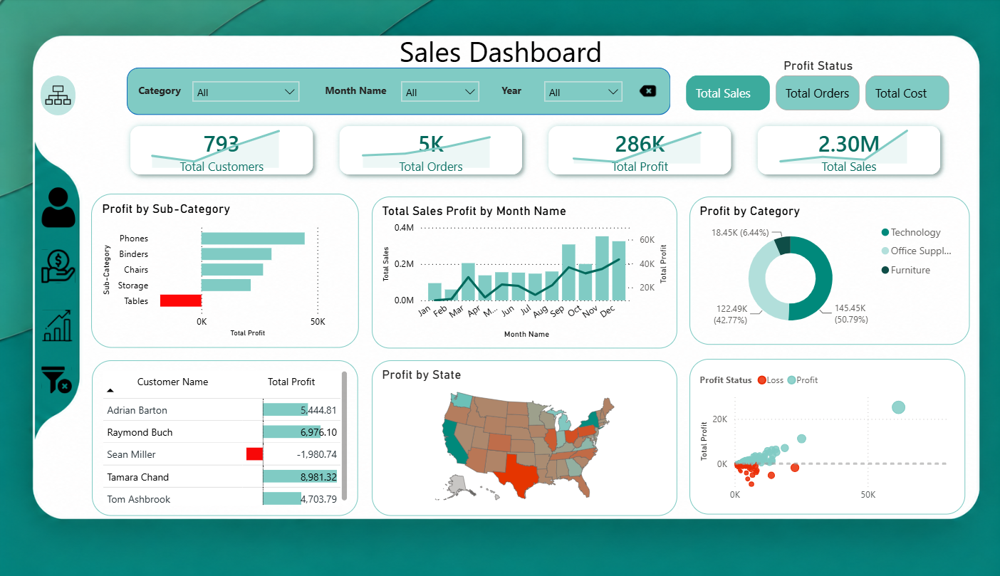
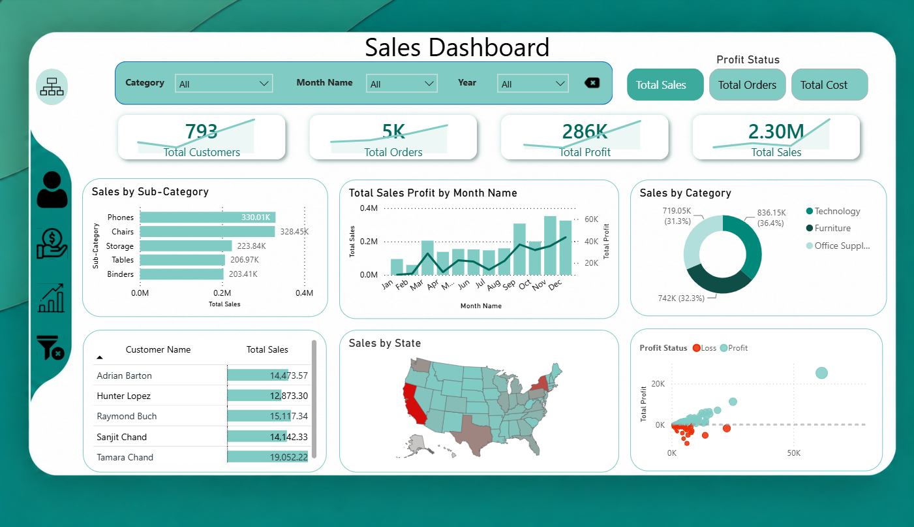

# Sales Performance Dashboard | Power BI

## Project Overview

This project presents an interactive Power BI dashboard designed to analyze sales performance, profitability, customer behavior, product performance, and geographic trends.

The dashboard transforms raw sales data into clear and actionable insights that support business decision-making through interactive KPIs, filters, and visualizations.

## Dashboard Preview





## Key KPIs

- Total Sales: $2.30M
- Total Profit: $286K
- Total Customers: 793
- Total Orders: 5K

## Analysis Areas

- Sales performance analysis
- Profitability analysis
- Customer performance
- Product and sub-category analysis
- Category performance
- Monthly sales and profit trends
- Geographic performance by state
- Profit and loss analysis

## Dashboard Features

- Interactive filtering by category, month, and year
- KPI cards for key business metrics
- Sales and profit trend analysis
- Customer-level performance analysis
- Category and sub-category comparison
- Geographic analysis using map visuals
- Profit/Loss segmentation
- Dynamic dashboard views for Sales and Profit analysis

## Tools & Technologies

- Power BI
- Power Query
- DAX
- Microsoft Excel
- Data Modeling
- Data Cleaning
- Data Visualization
- Business Intelligence

## Repository Structure

```text
power-bi-sales-dashboard/
│
├── Super Sales Dashboard.pbix
├── README.md
│
├── data/
│   └── Super Sales Dataset.xlsx
│
└── images/
    ├── sales_dashboard.png
    └── profit_dashboard.png
